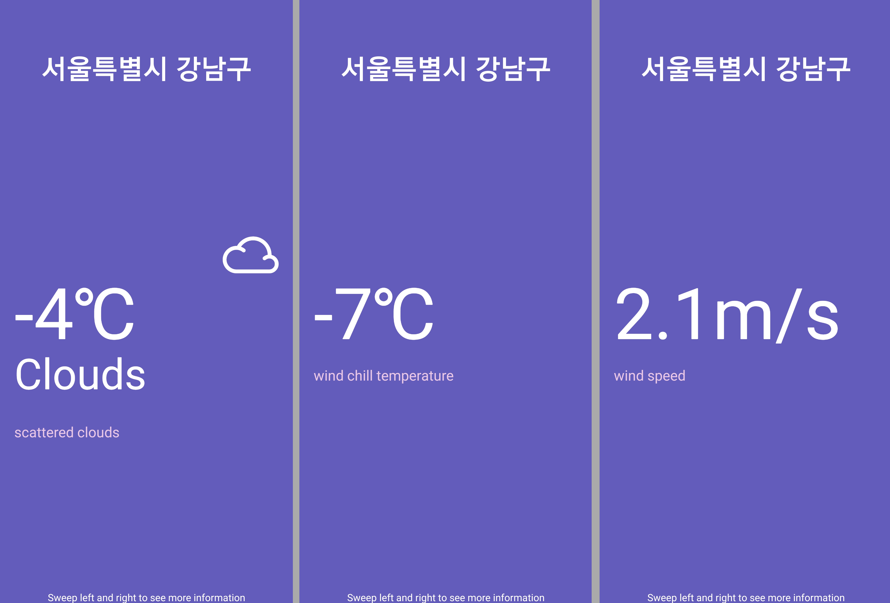
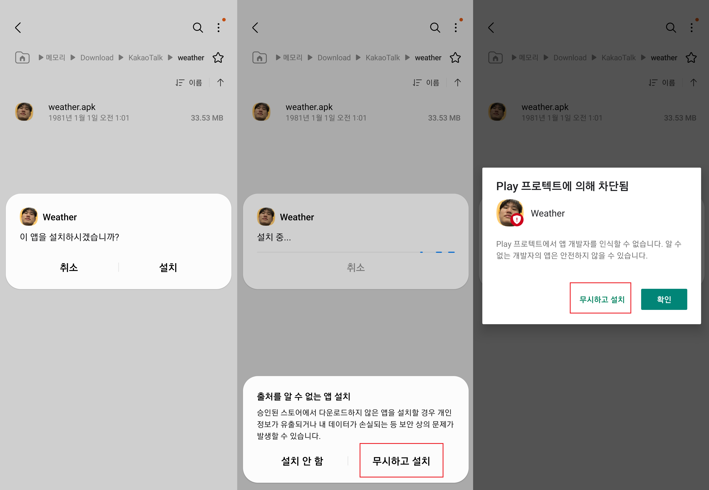

# react-native-weather-app
simple weather app (for practicing react-native) 
 
 
</img> 
 
 
## How to install
download "weather.apk" and please follow the installation process below. 
 
 
</img> 
 
 
## app build process
Please refer to the link in the post I wrote. 
 
https://yeohj0710.tistory.com/22 
 
 
 
